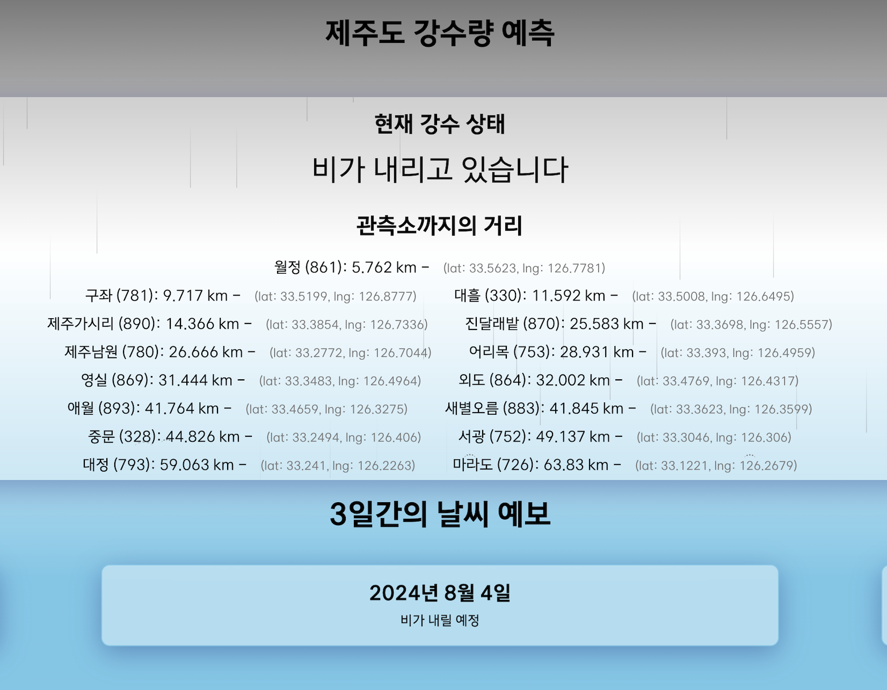
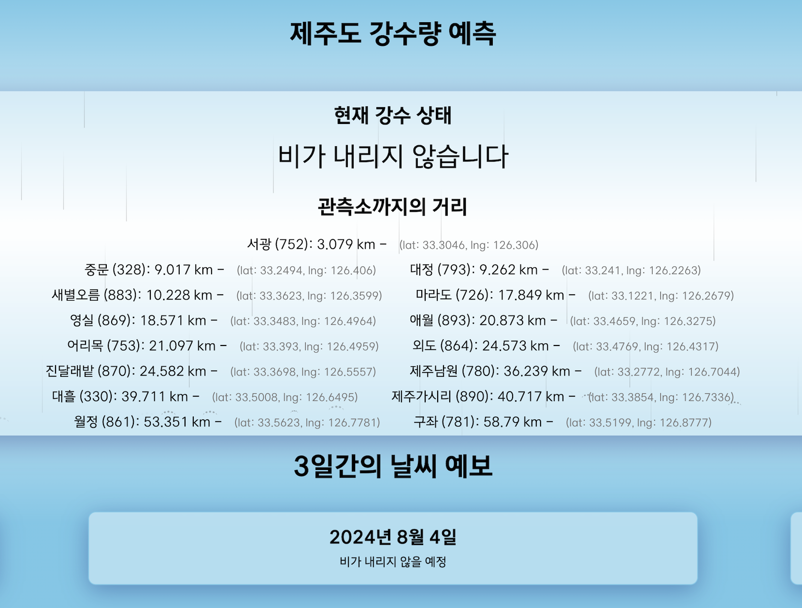

# ML Models for Project Rainfall

### Purpose

Predicting possible rainfall of today, tomorrow and the day after tomorrow of the requested location from client

## Contributors

<center>

|  |  |
|:-------------------------:|:-------------------------:|
| [jwywoo26@egmail.com](mailto:jwywoo26@gmail.com) | [이메일@example.com](mailto:이메일@example.com) |
| [GitHub](https://github.com/jwywoo) | [GitHub](https://github.com/H-y-hoon) |
| **Wooyong Jeong: Woo**             | **Yanghoon Ham: Eric**            |
| AI Developer             | AI Developer                 |

</center>

## Service Architecture: ML Model

<center>


</center>

## Classification Model: Woo

### Model Screenshots

<center>

| |  |
|:-------------------------:|:-------------------------:|
| **Raining**             | **Not Raining**            |

</center>

### Model Training Process & Hypothesis

- Hypothesis
    1. Previous three days of today might have characteristics of today's weather
    2. Thus, highly correlated features to rainfall of previous three days can be used as features to specify whether it's going to be raining or not in the future.
- Training Process
    1. Data acquisition and preprocessing: [data_preprocessing_assign.ipynb](https://github.com/jwywoo/colab-practice/blob/main/assign-practice/Preprocessing/data_preprocessing_assign.ipynb)
        1. API Request to [JejuDataHub](https://www.jejudatahub.net/data/view/data/579) to get weather data
        2. Remove invalid dataset under the conditions
            - If the dataset has not been updated for a month
            - If the dataset hasn't been recorded for at least 8 years
    2. ML model training: [ensemble_model_jeju.ipynb](https://github.com/jwywoo/colab-practice/blob/main/ml-model-practice/ensemble_learning/ensemble_learning_jeju.ipynb)
        1. Use `corr()` to find correlated features from dataset
        2. Train a Ensemble Model with Voting feature
            - SVM
            - KNN
            - Logistic Regression

### Classification Process

1. Returning 4 days of classification based on location
    - Request Structure(Request DTO)

        ```python
        # schema/prediction_request_schema.py
        from pydantic import BaseModel
        class PredictionRequestDto(BaseModel):
            obs_code : int
        ```

    - Response Structure(Response DTO)

        ```python
        # schema/prediction_response_schema.py
        class PredictionResponseDto(BaseModel):
            obs_name : str
            predicted_date : str
            raining_status : bool

        class PredictionsResponseDto(BaseModel):
            data: List[PredictionResponseDto]

    - Method

        ```python
        # routers/prediction_router.py
        router = APIRouter()

        @router.post("/predict/classify", response_model=PredictionsResponseDto)
        def read_classifications(request: PredictionRequestDto):
            return get_classification(request = request)
        
        # crud/classification_crud.py
        def get_prediction(request):
            # find obs
            ...
            # update with latest data
            ...
            # get model
            ...
            # generate prediction
            return {"data": predictions_list}
        ```

    - Response

        ```JSON
        {
            "data": [
                {
                    "obs_name": "마라도",
                    "predicted_date": "20240725",
                    "raining_status": true,
                    "raining_amount": 0
                },
                {
                    "obs_name": "마라도",
                    "predicted_date": "20240726",
                    "raining_status": true,
                    "raining_amount": 0
                },
                {
                    "obs_name": "마라도",
                    "predicted_date": "20240727",
                    "raining_status": true,
                    "raining_amount": 0
                },
                {
                    "obs_name": "마라도",
                    "predicted_date": "20240728", 
                    "raining_status": true,
                    "raining_amount": 0
                }
            ]
        }
        ```

## Prediction Model : Eric
